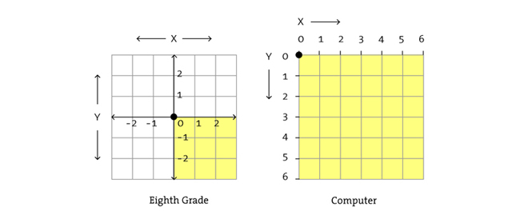

% Class 10: review
% Programming for VR I
% Patrick Mineault
---
pandoc-latex-fontsize:
  - classes: [listing]
    size: scriptsize
  - classes: [footnote]
    size: tiny
---

# Next class: exam

* Open-book, open-search, on the computer (includes these slides)
* Individual
* 3 hours
* Real-world problem
* Covers everything we've seen so far

# What we have seen so far

* Python syntax
* If/else
* Git
* Variables and basic data types
* Arithmetic
* For loops
* Random variables
* Functions
* Processing.py basics and flow, globals
* Coordinate systems
* Responding to inputs
* Debugging

# Python syntax and if/else

```{.python}
if 2 + 2 == 4:
  print("Everything is right with the world.")
else:
  print("Mayhem!")
print("The end.")
```

# Python syntax and if/else

* print function
* indentation is critical
* if/else block

# Git and Github

- Three commands:
   - `git add`
   - `git commit -m "message"`
   - `git push`
- Commit often, push often (e.g. once a class)
- When in doubt, search for "git cheat sheet"

# Variables and basic data types

```{.python}
num = 2 + 2
if num == 4:
  print("Everything is right with the world.")
else:
  print("Mayhem!")
print("The end.")
```

# Variables and basic data types

* variables: declare your own
* ints: 4, -27
* floats: 3.14159, 10.01
* strings: "hello", "world"
* booleans: True, False

# Arithmetic

 * `+`, `-`, `*`, `/`, `%`, `**`, `()`

# For loops

```{.python}
for i in range(5):
    print(i)
...
0
1
2
3
4
```

# Random variables

```{.python}
import random
print(random.random())
```

# Functions

```{.python}
def minus_fun(arg0, arg1):
  return arg0 - arg1
```

* def, function name, arguments and returns

# Processing.py basics

* `setup` called once
* `draw` called once per frame by default (60 fps)
* `draw` into the window
* https://py.processing.org/reference/

# Processing.py skeleton

```{.python}
def setup():
  size(400, 400)

def draw():
  line(0, 0, mouseX, mouseY)
```

# Processing.py skeleton

```{.python}
def setup():
  size(400, 400)

def draw():
  line(0, 0, mouseX, mouseY)
```

# Basic functions

* `line(x1, y1, x2, y2)`: draws a line
* `rect(x, y, wight, height)`: draws a rectangle
* `ellipse(x, y, width, height)`: draws an ellipse
* `point(x, y)`: draws a point
* `fill(r, g, b)`: sets the fill color
* `stroke(r, g, b)`: sets the stroke color
* `background(r, g, b)`: sets the canvas to the background color

# Coordinate systems



# Stacked coordinate systems

```{.python}
pushMatrix()
translate(x, y)
house()
popMatrix()
```

# Transformations

* `translate(x, y)`
* `rotate(radians)`: note 180 degrees = `PI` radians
* `size(scalex, scaley)`

# Responding to inputs

* `mouseX`, `mouseY`: mouse position
* `mousePressed`: whether any mouse button is pressed
* `mouseButton`: which mouse button is pressed, either `LEFT` or `RIGHT` (no quotes! these are CONSTANTS)
* `keyPressed`: whether a key has been pressed
* `key`: the key that's been pressed (e.g. 'A', '/', or `CODED`)
* `keyCode`: the key code when a special key has been pressed, for example, `UP`, `DOWN`, `LEFT`, `RIGHT`, `CTRL`, `SHIFT`.

# Debugging

* Google the error
* Read the manual
* Double-check the code
* Pair program
* Ask somebody else to look at your code
* Add print statements
* Refactor your code
* Use a debugger

# Challenge I

 * Single screen version of Flappy bird
 * https://www.youtube.com/watch?time_continue=86&v=HizwCzUOtDU&feature=emb_title

# Challenge II

* 10-minute game
* https://www.youtube.com/watch?v=p8MzsDBI5EI
