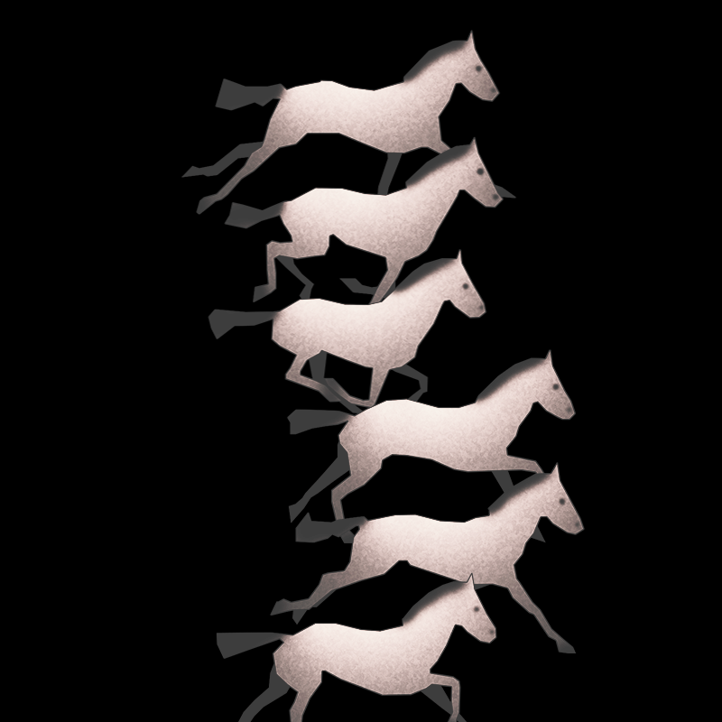

% Class 13: Object-oriented programming
% Programming for VR I
% Patrick Mineault
---
pandoc-latex-fontsize:
  - classes: [listing]
    size: scriptsize
  - classes: [footnote]
    size: tiny
---

# Last class

* Lists!

# Things to remember about lists

* A list has a length: `len(lst)`
* We can append to a list: `lst.append()`
* We can remove from a list: `lst.pop()`
* We can iterate through a list: `for i in range(len(lst)):`
* Lists are often accessed with FIFO or LIFO

# Who did the exercise?


# We're almost ready

* We've covered most of the tough concepts we need to program in VR
* We're still missing a big one: classes and objects

# Demo



# Classes

* Classes encapsulate data and behaviour
* For example: a horse class
* Has data like speed, sprite sheet, etc.
* Has behaviours like moving, drawing itself, etc.

# Why is that useful?

* You don't need to mess with the internals to get useful behaviour out of the class: encapsulation
* Cordon off complexity: teamwork
* Build by aggregation: reusable assets

# Classes

* Classes contain data:

```{.python .listing}
class Duck:
  def __init__(self):
    self.y_position = 0

my_duck = Duck()
print(my_duck.y_position)

my_duck.y_position = 100
print(my_duck.y_position)
```

# Classes

* Classes contain behaviour:

```{.python .listing}
class Duck:
  def make_some_noise(self):
    return "quack"

my_duck = Duck()
print(my_duck.make_some_noise())
```

# Classes

* Classes contain data and behaviour

```{.python .listing}
class Duck:
  def __init__(self, fancy):
    self.fancy = fancy

  def make_some_noise(self):
    if self.fancy:
      return "One might venture to say Quack"
    else:
      return "quack"

my_non_fancy_duck = Duck(False)
print(my_non_fancy_duck.make_some_noise())

my_fancy_duck = Duck(True)
print(my_fancy_duck.make_some_noise())
print(my_non_fancy_duck.make_some_noise())
```

# Things to know

* Declare class with `class`, everything else is indented
* What's inside: functions (a function linked to a class is called a method)
* `__init__(self, [extra_args])`: special declaration for the constructor, a function that's called when you create an object.
* The first argument to every method: `self` (referring to what's inside the object).
* When you call the class constructor, you create an instance of the class, which is what we call an object.

# Let's make our first class!

* Horse class
* Has an x position
* Has a method run that increases x and stores it back

# Independent data

* Each instance of a class has its own variables
* The variables are independent from each other

# Let's add to our class

* Multiple horses, each with a different speed (chosen at random)
* Horse class has a draw function - for now let's draw a circle

# Lists of objects

* Same methods, different data: different behaviour
* Pack objects inside of lists
* Particle systems, bullets, stars, etc.

# Iterating through lists of objects

```{.python .listing}
for i in range(len(objects)):
  obj = objects[i]
  obj.do_stuff()
```

```{.python .listing}
for obj in objects:
  obj.do_stuff()
```

# Using other people's classes

* Copy paste at the top of your main file
* Add it as a separate file and import
* Install a package and import (common outside of Processing)

# Let's use a simple class I made

* Sprite sheet animation
* Link
* For now let's copy paste at the top of our main file.

# Read the docs

* Let's read the docs for this class and create a sprite sheet animation.
